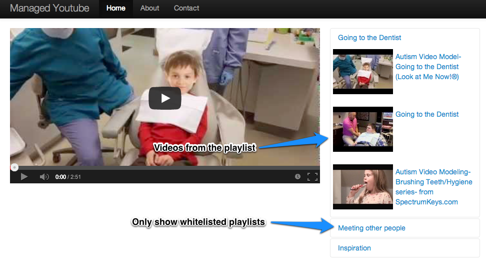

Managed Youtube
===============
Managed Youtube creates a customized Youtube viewing portal that allows you to manage what playlists and videos are accessible to your users.

Runnning it
-----------
1. Clone this repository

		git clone git@github.com:kelvl/managed-youtube.git

2. Create your Heroku application

		heroku apps:create

3. Add your Heroku remote to git

		heroku git:remote
	
	
4. Modify `playlists.txt` to add your whitelisted public Youtube playlist-ids
		
		PLufQu_4ePaEpPsfF2WPDi4fvMTJ5z_z0b
		PLufQu_4ePaEo45WdzqBcj8FIq6TCktyuI
		PLufQu_4ePaEoCDUCp34zY9VIpvxd_Cc9E

5. Push the application

		git push heroku master

6. Go to the application

		heroku open